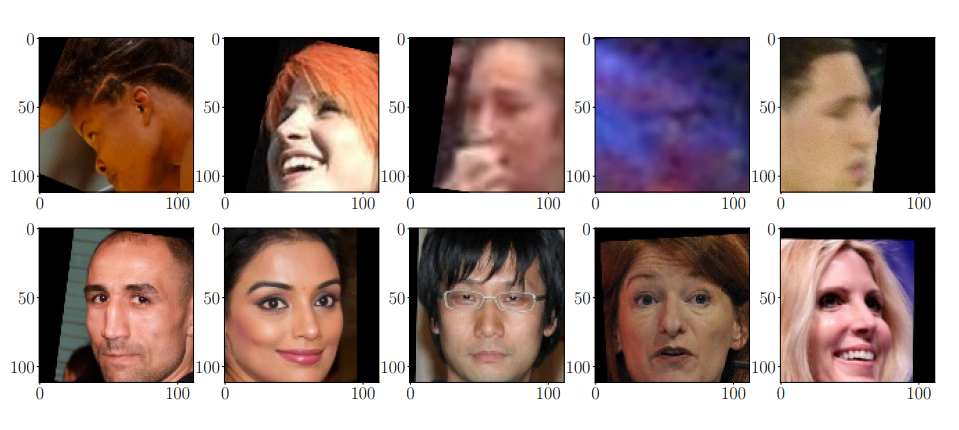
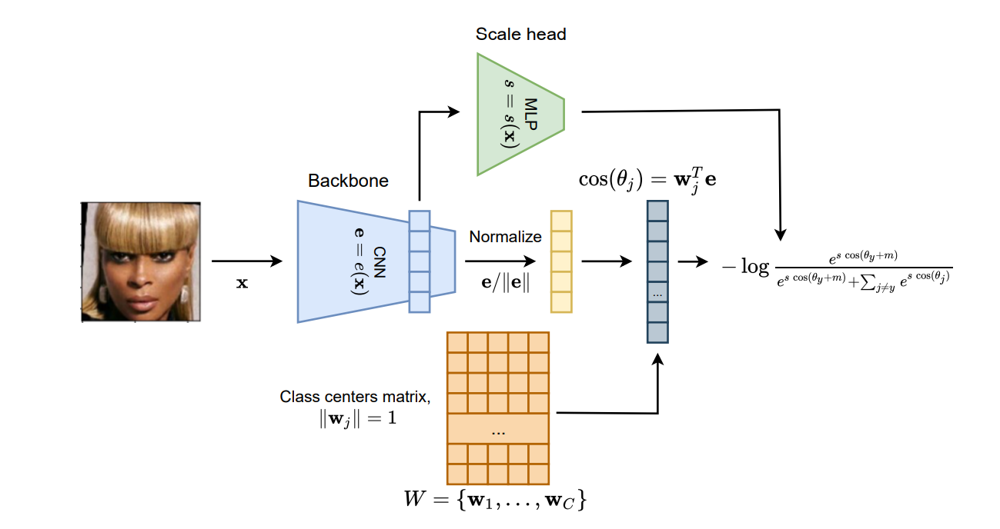
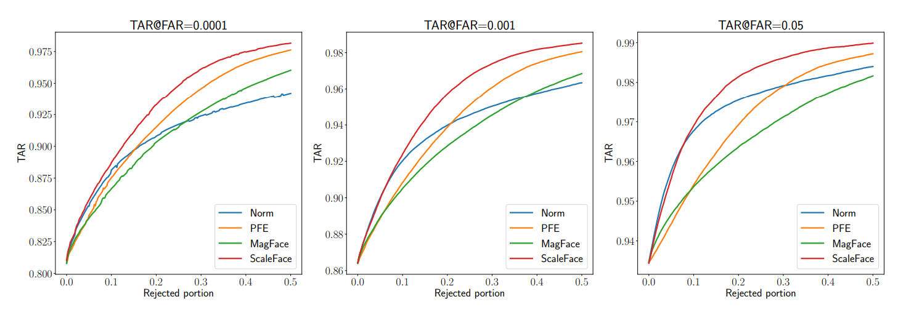

# ScaleFace

Repository is dedicated to evaluation of results of uncertainty estimation by ScaleFace method. The repository provides source code for experiments from paper.


### What is ScaleFace?

ScaleFace is a simple method for uncertainty estimation on metric learning / open-set classification tasks. It allows a model to distinguish an easy sample from a harder one. For example, in the following image, the top row is high uncertainty images, and the bottom line is low uncertainty.


One of the standard architectures for the tasks is ArcFace; we propose to make scale a trainable parameter in the ArcFace loss.



Uncertainty measure allows for filtering out the bad samples. You can use it for higher security or to send them for inspection to a human in the loop. For example, how accuracy grows with rejecting parts of the test samples on the IJB-C dataset (higher is better)




### Paper

You can read full paper here [https://arxiv.org/pdf/2209.01880.pdf](https://arxiv.org/pdf/2209.01880.pdf). For the citation 
```bibtex
@article{Kail2022ScaleFaceUD,
  title={ScaleFace: Uncertainty-aware Deep Metric Learning},
  author={Roma Kail and Kirill Fedyanin and Nikita Muravev and Alexey Zaytsev and Maxim Panov},
  journal={ArXiv},
  year={2022},
  volume={abs/2209.01880}
}
```


### INSTALL

For now just install the requirements in `requirements.txt`


### Training

For a face recognition experiments we use iResNet-50 model. The pretrained model checkpoint could be found in Insight Face [repository](https://github.com/deepinsight/insightface/tree/master/model_zoo).

You can see `scripts/train` for training scripts.
To train you'll need the data (MS1M-V2 dataset)

### Evaluation

Majority of tests run on an aligned version of IJBC dataset.
Aligned IJBC and pre-trained models can be downloaded [here](https://drive.google.com/drive/folders/1CD8-b4bzqBnCVLXAb5aOJRmmdrB5usDd?usp=sharing)


Scripts to verification pipeline on certain tasks can be found in folder ```scripts``` (*eval_fusion.sh*, *eval_reject_verification.sh*, *eval_template_reject_verification.sh*, *eval_uncertainty_distribution.sh*)
Uncomment one of the scripts, modify checkpoint path, data_path and save_path and then run the script.

#### Reject verification

Reject verification pipeline can be ran, using following script:
```bash
python3 ./face_lib/evaluation/reject_verification.py <args>
```

It takes pairs of images, for each pair predicts distance and uncertainty values. Then calculates dependence of TAR@FAR from portion of filtered out images.

* ```--checkpoint_path``` &mdash; path to checkpoint, containing weights of backbone model and uncertainty estimator
* ```--dataset_path``` &mdash; path to the aligned version of validation dataset.
* ```--pairs_table_path``` &mdash; path to file, which determines how dataset should be separated into pairs
* ```--config_path``` &mdash; path to config of the model
* ```--batch_size``` &mdash; size of the batch, used furing calculation of distance and uncertainty
* ```--uncertainty_strategy``` &mdash; method, which is used to calculate uncertainty. Possible options : [head, GAN, classifier, scale, emb_norm, magface]
  - head &mdash An extra head of a network is used to predict uncertainty (i. e. PFE)
  - GAN &mdash Descrimintor score from GAN
  - classifier &mdash; Entropy from prediction of classifier is taken
  - scale &mdash; Score from scale head is used
  - emb_norm &mdash Norm of embedding before normalization
  - magface &mdash A method from Magface article
* ```--uncertainty_mode``` &mdash; Defines whether model predicts uncertainty or confidence
* ```--FARs``` &mdash; Defines FAR values for TAR@FAR metric
* ```--rejected_portion``` &mdash; Defines rejected portions for which reject verification will be calculated ($(seq <start> <step> <finish>) can be used for an arange)
* ```--distance_uncertainty_metrics``` &mdash; Defines ways of calculating distance and uncertainty of a pair from two embeddings and two uncertainties. It is an arrayof strings in <distance>-<uncertainty> manner.
* ```--device_id``` &mdash; Id of GPU to calculate results 
* ```--save_fig_path``` &mdash; Paths to save the result. The folder with this nam eshould not exist

Examples of script can be found in ```scripts/eval_reject_verification.sh```

#### Fusion

Calculates TAR@FAR for fusion verification protocol from IJBC. Weights for fusion are taken from PFE or other uncertainty technique.
```bash
python3 ./face_lib/evaluation/fusion.py <args>
```

Arguments :

* ```--checkpoint_path``` &mdash; path to checkpoint, containing weights of backbone model and uncertainty estimator
* ```--dataset_path``` &mdash; path to the aligned version of validation dataset.
* ```--protocol_path``` &mdash; path to file, which determines fusion protocol
* ```--config_path``` &mdash; path to config of the model
* ```--batch_size``` &mdash; size of the batch, used furing calculation of distance and uncertainty
* ```--uncertainty_strategy``` &mdash; method, which is used to calculate uncertainty. Possible options : [head, GAN, classifier, scale, emb_norm, magface]
  - head &mdash An extra head of a network is used to predict uncertainty (i. e. PFE)
* ```--uncertainty_mode``` &mdash; Defines whether model predicts uncertainty or confidence
* ```--FARs``` &mdash; Defines FAR values for TAR@FAR metric
* ```--rejected_portion``` &mdash; Defines rejected portions for which reject verification will be calculated ($(seq <start> <step> <finish>) can be used for an arange)
* ```--distance_uncertainty_metrics``` &mdash; Defines ways of calculating distance and uncertainty of a pair from two embeddings and two uncertainties. It is an arrayof strings in <distance>-<uncertainty> manner.
* ```--device_id``` &mdash; Id of GPU to calculate results 
* ```--save_fig_path``` &mdash; Paths to save the result. The folder with this nam eshould not exist

Examples of script can be found in ```scripts/eval_reject_verification.sh```. 


#### Uncertainty distribution

Dumps distribution of uncertainty, predicted by the method.

```bash
python3 ./face_lib/evaluation/uncertainty_distribution.py <args>
```

Arguments :

* ```--checkpoint_path``` &mdash; path to checkpoint, containing weights of backbone model and uncertainty estimator
* ```--dataset_path``` &mdash; path to the aligned version of validation dataset.
* ```--image_paths_table``` &mdash; path to file, with relative paths of images
* ```--config_path``` &mdash; path to config of the model
* ```--batch_size``` &mdash; size of the batch, used furing calculation of distance and uncertainty
* ```--dataset_name``` &mdash; Name of the dataset ("MS1MV2", "IJBC", "LFW")
* ```--device_id``` &mdash; Id of GPU to calculate results 
* ```--save_fig_path``` &mdash; Paths to save the result. The folder with this nam eshould not exist

Examples of script can be found in ```eval_uncertainty_distribution.sh```. 


## References
<a id="1">[1]</a> 
Liu et at.,
SphereFace: Deep Hypersphere Embedding for Face Recognition. 
2017 IEEE Conference on Computer Vision and Pattern Recognition (CVPR)

<a id="2">[2]</a> 
Deng et at.,
ArcFace: Additive Angular Margin Loss for Deep Face Recognition.
2019 IEEE/CVF Conference on Computer Vision and Pattern Recognition (CVPR).